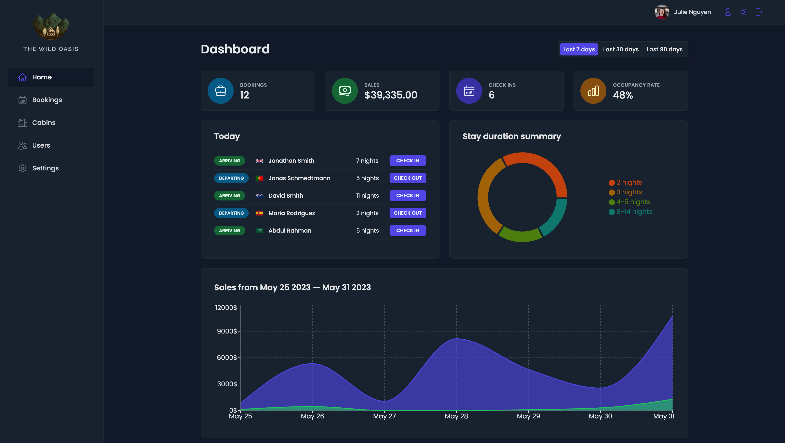
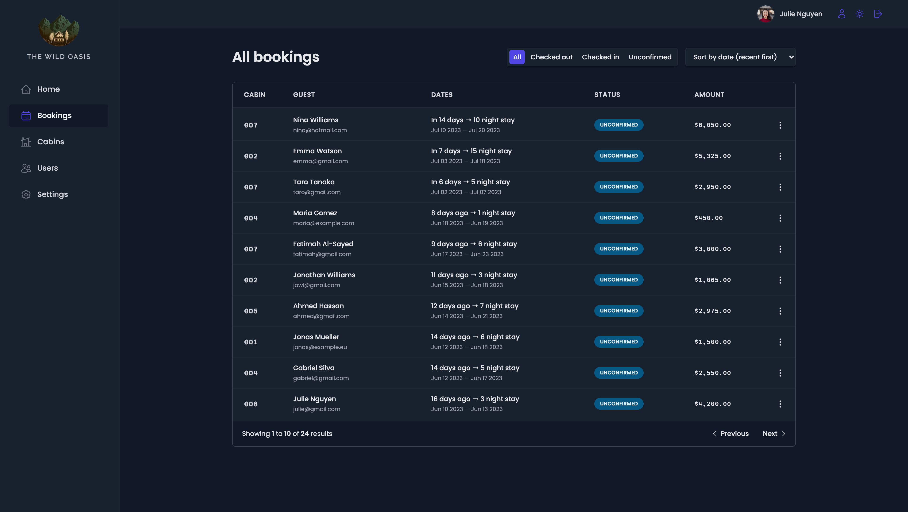
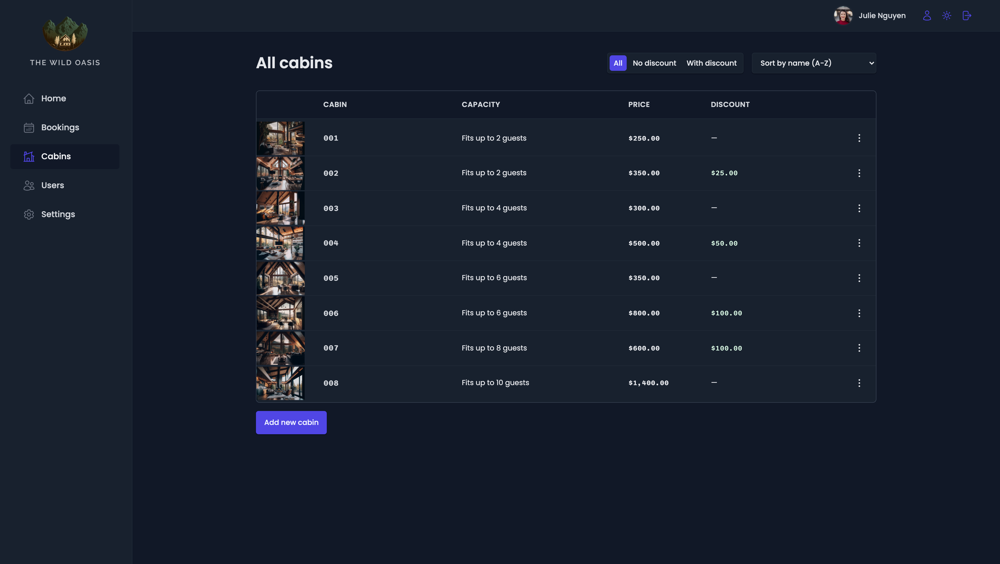
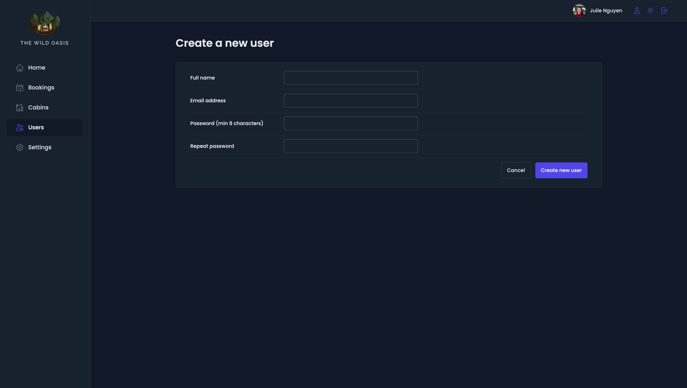
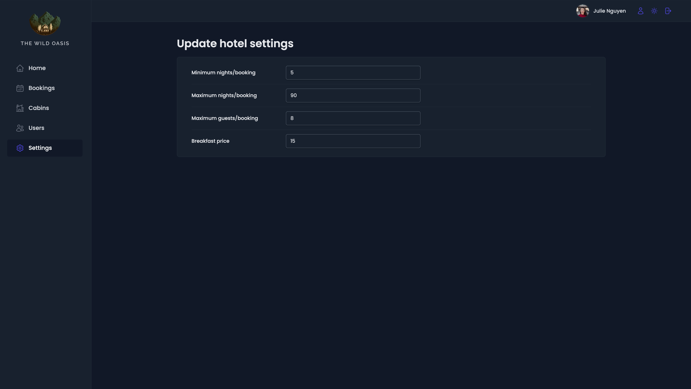

# The Wild Oasis 1.0

An 'in-house' application for a fictitious small boutique hotel, with 8 luxuirous wooden cabins, that displays information about hotel rooms, guests bookings and revenue generated all from a beautifully styled dashboard. The app will allow the hotel to manage bookings, cabins and guests, as well as the ability to create additional staff users.

## Tech stack used in this project

### Main tools:

-   Language: [**_TypeScript_**](https://www.typescriptlang.org/)
-   Framework/Library: [**_ReactJS_**](https://react.dev/)
-   Routing: [**_React Router_**](https://reactrouter.com/en/main)
-   Remote state management: [**_React Query_**](https://tanstack.com/query/latest)
-   UI state management: [**_Context API_**](https://react.dev/learn/passing-data-deeply-with-context)
-   Form managament: [**_React Hook Form_**](https://react-hook-form.com/)
-   Styling: [**_Styled components_**](https://styled-components.com)

### Additional tools:

-   Icons: [**_React Icons_**](https://react-icons.github.io/react-icons/)
-   Notifications: [**_React Hot Toast_**](https://react-hot-toast.com/)
-   Charts displays: [**_Recharts_**](https://recharts.org/en-US/)
-   Date manipulation: [**_date-fns_**](https://date-fns.org/)
-   Remote state storage and API: [**_Supabase_**](https://supabase.com/)
